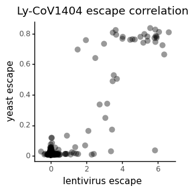

# Compare full spike lentivirus DMS data with yeast DMS data for Ly-CoV1404


```python
import itertools
import math
import os
import re
import warnings

from IPython.display import display, HTML

import matplotlib
import matplotlib as mpl
import matplotlib.pyplot as plt
import natsort

import numpy as np
import pandas as pd
from plotnine import *
import seaborn

import neutcurve
from neutcurve.colorschemes import CBMARKERS, CBPALETTE

import yaml
```


```python
warnings.simplefilter('ignore')
```


```python
with open('config.yaml') as f:
    config = yaml.safe_load(f)
```


```python
theme_set(theme_seaborn(style='white', context='talk', font_scale=1))
plt.style.use('seaborn-white')
```


```python
resultsdir=config['resultsdir']
os.makedirs(resultsdir, exist_ok=True)
```


```python
#read data
lenti_DMS = pd.read_csv(config['lenti_dms_lycov1404'])
yeast_DMS = pd.read_csv(config['yeast_dms_lycov1404_Star'])
```


```python
a = ['214a' , '214b', '214c']
lenti_DMS = lenti_DMS[~lenti_DMS['site'].isin(a)]

lenti_DMS['site']=lenti_DMS['site'].astype(int)
```

## Compare to yeast DMS dataset


```python
merged_DMS = pd.merge(yeast_DMS, lenti_DMS,  how='inner',
                      left_on=['site','wildtype', 'mutation'],
                      right_on = ['site','wildtype', 'mutant'])
merged_DMS
```


<div>
<style scoped>
    .dataframe tbody tr th:only-of-type {
        vertical-align: middle;
    }

    .dataframe tbody tr th {
        vertical-align: top;
    }

    .dataframe thead th {
        text-align: right;
    }
</style>
<table border="1" class="dataframe">
  <thead>
    <tr style="text-align: right;">
      <th></th>
      <th>condition</th>
      <th>site</th>
      <th>wildtype</th>
      <th>mutation_x</th>
      <th>mut_escape</th>
      <th>site_total_escape</th>
      <th>site_max_escape</th>
      <th>epitope</th>
      <th>mutant</th>
      <th>mutation_y</th>
      <th>escape_mean</th>
      <th>escape_median</th>
      <th>escape_std</th>
      <th>n_models</th>
      <th>times_seen</th>
      <th>frac_models</th>
    </tr>
  </thead>
  <tbody>
    <tr>
      <th>0</th>
      <td>LY-CoV1404 - BA1</td>
      <td>331</td>
      <td>N</td>
      <td>D</td>
      <td>0.011720</td>
      <td>0.1646</td>
      <td>0.02958</td>
      <td>1</td>
      <td>D</td>
      <td>N331D</td>
      <td>0.2803</td>
      <td>0.0711</td>
      <td>0.4805</td>
      <td>4</td>
      <td>3.2500</td>
      <td>1.00</td>
    </tr>
    <tr>
      <th>1</th>
      <td>LY-CoV1404 - BA1</td>
      <td>331</td>
      <td>N</td>
      <td>E</td>
      <td>0.007214</td>
      <td>0.1646</td>
      <td>0.02958</td>
      <td>1</td>
      <td>E</td>
      <td>N331E</td>
      <td>-0.0198</td>
      <td>-0.0222</td>
      <td>0.0178</td>
      <td>3</td>
      <td>2.6667</td>
      <td>0.75</td>
    </tr>
    <tr>
      <th>2</th>
      <td>LY-CoV1404 - BA1</td>
      <td>331</td>
      <td>N</td>
      <td>H</td>
      <td>0.008024</td>
      <td>0.1646</td>
      <td>0.02958</td>
      <td>1</td>
      <td>H</td>
      <td>N331H</td>
      <td>-0.0008</td>
      <td>0.0072</td>
      <td>0.0142</td>
      <td>3</td>
      <td>3.6667</td>
      <td>0.75</td>
    </tr>
    <tr>
      <th>3</th>
      <td>LY-CoV1404 - BA1</td>
      <td>331</td>
      <td>N</td>
      <td>K</td>
      <td>0.014850</td>
      <td>0.1646</td>
      <td>0.02958</td>
      <td>1</td>
      <td>K</td>
      <td>N331K</td>
      <td>0.0192</td>
      <td>0.0096</td>
      <td>0.0284</td>
      <td>4</td>
      <td>2.2500</td>
      <td>1.00</td>
    </tr>
    <tr>
      <th>4</th>
      <td>LY-CoV1404 - BA1</td>
      <td>331</td>
      <td>N</td>
      <td>S</td>
      <td>0.022960</td>
      <td>0.1646</td>
      <td>0.02958</td>
      <td>1</td>
      <td>S</td>
      <td>N331S</td>
      <td>0.0232</td>
      <td>0.0070</td>
      <td>0.0513</td>
      <td>4</td>
      <td>6.0000</td>
      <td>1.00</td>
    </tr>
    <tr>
      <th>...</th>
      <td>...</td>
      <td>...</td>
      <td>...</td>
      <td>...</td>
      <td>...</td>
      <td>...</td>
      <td>...</td>
      <td>...</td>
      <td>...</td>
      <td>...</td>
      <td>...</td>
      <td>...</td>
      <td>...</td>
      <td>...</td>
      <td>...</td>
      <td>...</td>
    </tr>
    <tr>
      <th>887</th>
      <td>LY-CoV1404 - BA1</td>
      <td>530</td>
      <td>S</td>
      <td>I</td>
      <td>0.008317</td>
      <td>0.1846</td>
      <td>0.01248</td>
      <td>1</td>
      <td>I</td>
      <td>S530I</td>
      <td>-0.0179</td>
      <td>-0.0100</td>
      <td>0.0218</td>
      <td>3</td>
      <td>1.6667</td>
      <td>0.75</td>
    </tr>
    <tr>
      <th>888</th>
      <td>LY-CoV1404 - BA1</td>
      <td>530</td>
      <td>S</td>
      <td>N</td>
      <td>0.008328</td>
      <td>0.1846</td>
      <td>0.01248</td>
      <td>1</td>
      <td>N</td>
      <td>S530N</td>
      <td>-0.3006</td>
      <td>-0.0419</td>
      <td>0.5470</td>
      <td>4</td>
      <td>10.5000</td>
      <td>1.00</td>
    </tr>
    <tr>
      <th>889</th>
      <td>LY-CoV1404 - BA1</td>
      <td>530</td>
      <td>S</td>
      <td>V</td>
      <td>0.007884</td>
      <td>0.1846</td>
      <td>0.01248</td>
      <td>1</td>
      <td>V</td>
      <td>S530V</td>
      <td>-0.0221</td>
      <td>-0.0221</td>
      <td>0.0090</td>
      <td>2</td>
      <td>5.0000</td>
      <td>0.50</td>
    </tr>
    <tr>
      <th>890</th>
      <td>LY-CoV1404 - BA1</td>
      <td>530</td>
      <td>S</td>
      <td>W</td>
      <td>0.009851</td>
      <td>0.1846</td>
      <td>0.01248</td>
      <td>1</td>
      <td>W</td>
      <td>S530W</td>
      <td>-0.0362</td>
      <td>-0.0362</td>
      <td>NaN</td>
      <td>1</td>
      <td>1.0000</td>
      <td>0.25</td>
    </tr>
    <tr>
      <th>891</th>
      <td>LY-CoV1404 - BA1</td>
      <td>531</td>
      <td>T</td>
      <td>N</td>
      <td>0.007873</td>
      <td>0.1987</td>
      <td>0.02281</td>
      <td>1</td>
      <td>N</td>
      <td>T531N</td>
      <td>-0.0150</td>
      <td>-0.0150</td>
      <td>NaN</td>
      <td>1</td>
      <td>1.0000</td>
      <td>0.25</td>
    </tr>
  </tbody>
</table>
<p>892 rows × 16 columns</p>
</div>


```python
merged_DMS = merged_DMS[['site', 'mutation_y', 'mut_escape' , 'escape_mean', 'escape_median', 'n_models', 'times_seen', 'frac_models','wildtype', 'mutation_x']]
merged_DMS

```


<div>
<style scoped>
    .dataframe tbody tr th:only-of-type {
        vertical-align: middle;
    }

    .dataframe tbody tr th {
        vertical-align: top;
    }

    .dataframe thead th {
        text-align: right;
    }
</style>
<table border="1" class="dataframe">
  <thead>
    <tr style="text-align: right;">
      <th></th>
      <th>site</th>
      <th>mutation_y</th>
      <th>mut_escape</th>
      <th>escape_mean</th>
      <th>escape_median</th>
      <th>n_models</th>
      <th>times_seen</th>
      <th>frac_models</th>
      <th>wildtype</th>
      <th>mutation_x</th>
    </tr>
  </thead>
  <tbody>
    <tr>
      <th>0</th>
      <td>331</td>
      <td>N331D</td>
      <td>0.011720</td>
      <td>0.2803</td>
      <td>0.0711</td>
      <td>4</td>
      <td>3.2500</td>
      <td>1.00</td>
      <td>N</td>
      <td>D</td>
    </tr>
    <tr>
      <th>1</th>
      <td>331</td>
      <td>N331E</td>
      <td>0.007214</td>
      <td>-0.0198</td>
      <td>-0.0222</td>
      <td>3</td>
      <td>2.6667</td>
      <td>0.75</td>
      <td>N</td>
      <td>E</td>
    </tr>
    <tr>
      <th>2</th>
      <td>331</td>
      <td>N331H</td>
      <td>0.008024</td>
      <td>-0.0008</td>
      <td>0.0072</td>
      <td>3</td>
      <td>3.6667</td>
      <td>0.75</td>
      <td>N</td>
      <td>H</td>
    </tr>
    <tr>
      <th>3</th>
      <td>331</td>
      <td>N331K</td>
      <td>0.014850</td>
      <td>0.0192</td>
      <td>0.0096</td>
      <td>4</td>
      <td>2.2500</td>
      <td>1.00</td>
      <td>N</td>
      <td>K</td>
    </tr>
    <tr>
      <th>4</th>
      <td>331</td>
      <td>N331S</td>
      <td>0.022960</td>
      <td>0.0232</td>
      <td>0.0070</td>
      <td>4</td>
      <td>6.0000</td>
      <td>1.00</td>
      <td>N</td>
      <td>S</td>
    </tr>
    <tr>
      <th>...</th>
      <td>...</td>
      <td>...</td>
      <td>...</td>
      <td>...</td>
      <td>...</td>
      <td>...</td>
      <td>...</td>
      <td>...</td>
      <td>...</td>
      <td>...</td>
    </tr>
    <tr>
      <th>887</th>
      <td>530</td>
      <td>S530I</td>
      <td>0.008317</td>
      <td>-0.0179</td>
      <td>-0.0100</td>
      <td>3</td>
      <td>1.6667</td>
      <td>0.75</td>
      <td>S</td>
      <td>I</td>
    </tr>
    <tr>
      <th>888</th>
      <td>530</td>
      <td>S530N</td>
      <td>0.008328</td>
      <td>-0.3006</td>
      <td>-0.0419</td>
      <td>4</td>
      <td>10.5000</td>
      <td>1.00</td>
      <td>S</td>
      <td>N</td>
    </tr>
    <tr>
      <th>889</th>
      <td>530</td>
      <td>S530V</td>
      <td>0.007884</td>
      <td>-0.0221</td>
      <td>-0.0221</td>
      <td>2</td>
      <td>5.0000</td>
      <td>0.50</td>
      <td>S</td>
      <td>V</td>
    </tr>
    <tr>
      <th>890</th>
      <td>530</td>
      <td>S530W</td>
      <td>0.009851</td>
      <td>-0.0362</td>
      <td>-0.0362</td>
      <td>1</td>
      <td>1.0000</td>
      <td>0.25</td>
      <td>S</td>
      <td>W</td>
    </tr>
    <tr>
      <th>891</th>
      <td>531</td>
      <td>T531N</td>
      <td>0.007873</td>
      <td>-0.0150</td>
      <td>-0.0150</td>
      <td>1</td>
      <td>1.0000</td>
      <td>0.25</td>
      <td>T</td>
      <td>N</td>
    </tr>
  </tbody>
</table>
<p>892 rows × 10 columns</p>
</div>


```python
escape_corr=(
    ggplot(merged_DMS.loc[(merged_DMS['frac_models'] >=0.75)&( merged_DMS['times_seen'] >=3)&(merged_DMS['n_models'] >=3)]) +
    aes(x="escape_median", y="mut_escape") +
    geom_point(size=4, alpha=0.4, stroke = 0) + 
    theme_classic() +
    theme(figure_size=(3,3)) +
    labs(
        title = "Ly-CoV1404 escape correlation",
        x="lentivirus escape",
        y="yeast escape")
)

_ = escape_corr.draw()

_.savefig(f'{resultsdir}/escape_corr_yeast.pdf', bbox_inches='tight')

```


    

    


```python

```
