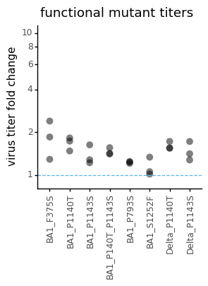
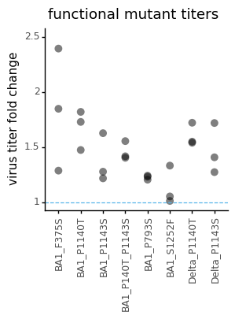

# Plot functional mutant titer fold change

This notebook plots fold change in virus titers. 
Fold change was pre-calculated from titers calculated in virus_titers_functional_mutants.ipynb notebook


```python
import os
import warnings

import math
import numpy as np 

from IPython.display import display, HTML
import matplotlib.pyplot as plt

from neutcurve.colorschemes import CBMARKERS, CBPALETTE
from mizani.formatters import scientific_format

import pandas as pd
from plotnine import *

import yaml
```


```python
warnings.simplefilter('ignore')
```


```python
with open('config.yaml') as f:
    config = yaml.safe_load(f)
```


```python
resultsdir=config['resultsdir']
os.makedirs(resultsdir, exist_ok=True)
```


```python
titer_fold_change = pd.read_csv(config['titer_fold_change'])
titer_fold_change
```


<div>
<style scoped>
    .dataframe tbody tr th:only-of-type {
        vertical-align: middle;
    }

    .dataframe tbody tr th {
        vertical-align: top;
    }

    .dataframe thead th {
        text-align: right;
    }
</style>
<table border="1" class="dataframe">
  <thead>
    <tr style="text-align: right;">
      <th></th>
      <th>virus</th>
      <th>date</th>
      <th>rescue_batch</th>
      <th>for_testing</th>
      <th>RLUperuL</th>
      <th>WT_titers</th>
      <th>fold_change</th>
    </tr>
  </thead>
  <tbody>
    <tr>
      <th>0</th>
      <td>BA1_F375S</td>
      <td>190722</td>
      <td>1</td>
      <td>functional_validation</td>
      <td>9.230974e+05</td>
      <td>4.996201e+05</td>
      <td>1.847599</td>
    </tr>
    <tr>
      <th>1</th>
      <td>BA1_F375S</td>
      <td>190722</td>
      <td>2</td>
      <td>functional_validation</td>
      <td>6.427330e+05</td>
      <td>4.996201e+05</td>
      <td>1.286443</td>
    </tr>
    <tr>
      <th>2</th>
      <td>BA1_F375S</td>
      <td>190722</td>
      <td>3</td>
      <td>functional_validation</td>
      <td>1.195813e+06</td>
      <td>4.996201e+05</td>
      <td>2.393444</td>
    </tr>
    <tr>
      <th>3</th>
      <td>BA1_P793S</td>
      <td>200722</td>
      <td>1</td>
      <td>functional_validation</td>
      <td>1.365625e+06</td>
      <td>1.133708e+06</td>
      <td>1.204566</td>
    </tr>
    <tr>
      <th>4</th>
      <td>BA1_P793S</td>
      <td>200722</td>
      <td>2</td>
      <td>functional_validation</td>
      <td>1.232795e+06</td>
      <td>1.001413e+06</td>
      <td>1.231055</td>
    </tr>
    <tr>
      <th>5</th>
      <td>BA1_P793S</td>
      <td>200722</td>
      <td>3</td>
      <td>functional_validation</td>
      <td>1.275231e+06</td>
      <td>1.027659e+06</td>
      <td>1.240909</td>
    </tr>
    <tr>
      <th>6</th>
      <td>BA1_P1140T</td>
      <td>180722</td>
      <td>1</td>
      <td>functional_validation</td>
      <td>7.436016e+05</td>
      <td>4.087164e+05</td>
      <td>1.819358</td>
    </tr>
    <tr>
      <th>7</th>
      <td>BA1_P1140T</td>
      <td>180722</td>
      <td>2</td>
      <td>functional_validation</td>
      <td>7.144444e+05</td>
      <td>4.848001e+05</td>
      <td>1.473689</td>
    </tr>
    <tr>
      <th>8</th>
      <td>BA1_P1140T</td>
      <td>180722</td>
      <td>3</td>
      <td>functional_validation</td>
      <td>8.939412e+05</td>
      <td>5.172177e+05</td>
      <td>1.728366</td>
    </tr>
    <tr>
      <th>9</th>
      <td>BA1_P1143S</td>
      <td>180722</td>
      <td>1</td>
      <td>functional_validation</td>
      <td>6.646749e+05</td>
      <td>4.087164e+05</td>
      <td>1.626250</td>
    </tr>
    <tr>
      <th>10</th>
      <td>BA1_P1143S</td>
      <td>180722</td>
      <td>2</td>
      <td>functional_validation</td>
      <td>5.898170e+05</td>
      <td>4.848001e+05</td>
      <td>1.216619</td>
    </tr>
    <tr>
      <th>11</th>
      <td>BA1_P1143S</td>
      <td>180722</td>
      <td>3</td>
      <td>functional_validation</td>
      <td>6.604765e+05</td>
      <td>5.172177e+05</td>
      <td>1.276980</td>
    </tr>
    <tr>
      <th>12</th>
      <td>BA1_P140T_P1143S</td>
      <td>180722</td>
      <td>1</td>
      <td>functional_validation</td>
      <td>6.352270e+05</td>
      <td>4.087164e+05</td>
      <td>1.554200</td>
    </tr>
    <tr>
      <th>13</th>
      <td>BA1_P140T_P1143S</td>
      <td>180722</td>
      <td>2</td>
      <td>functional_validation</td>
      <td>6.802035e+05</td>
      <td>4.848001e+05</td>
      <td>1.403060</td>
    </tr>
    <tr>
      <th>14</th>
      <td>BA1_P140T_P1143S</td>
      <td>180722</td>
      <td>3</td>
      <td>functional_validation</td>
      <td>7.326845e+05</td>
      <td>5.172177e+05</td>
      <td>1.416588</td>
    </tr>
    <tr>
      <th>15</th>
      <td>BA1_S1252F</td>
      <td>180722</td>
      <td>1</td>
      <td>functional_validation</td>
      <td>5.444239e+05</td>
      <td>4.087164e+05</td>
      <td>1.332033</td>
    </tr>
    <tr>
      <th>16</th>
      <td>BA1_S1252F</td>
      <td>180722</td>
      <td>2</td>
      <td>functional_validation</td>
      <td>5.102484e+05</td>
      <td>4.848001e+05</td>
      <td>1.052492</td>
    </tr>
    <tr>
      <th>17</th>
      <td>BA1_S1252F</td>
      <td>180722</td>
      <td>3</td>
      <td>functional_validation</td>
      <td>5.232961e+05</td>
      <td>5.172177e+05</td>
      <td>1.011752</td>
    </tr>
    <tr>
      <th>18</th>
      <td>Delta_P1140T</td>
      <td>180722</td>
      <td>1</td>
      <td>functional_validation</td>
      <td>2.044512e+06</td>
      <td>1.319633e+06</td>
      <td>1.549303</td>
    </tr>
    <tr>
      <th>19</th>
      <td>Delta_P1140T</td>
      <td>180722</td>
      <td>2</td>
      <td>functional_validation</td>
      <td>1.712281e+06</td>
      <td>1.112373e+06</td>
      <td>1.539305</td>
    </tr>
    <tr>
      <th>20</th>
      <td>Delta_P1140T</td>
      <td>180722</td>
      <td>3</td>
      <td>functional_validation</td>
      <td>2.270375e+06</td>
      <td>1.319245e+06</td>
      <td>1.720966</td>
    </tr>
    <tr>
      <th>21</th>
      <td>Delta_P1143S</td>
      <td>180722</td>
      <td>1</td>
      <td>functional_validation</td>
      <td>1.679984e+06</td>
      <td>1.319633e+06</td>
      <td>1.273069</td>
    </tr>
    <tr>
      <th>22</th>
      <td>Delta_P1143S</td>
      <td>180722</td>
      <td>2</td>
      <td>functional_validation</td>
      <td>1.911510e+06</td>
      <td>1.112373e+06</td>
      <td>1.718408</td>
    </tr>
    <tr>
      <th>23</th>
      <td>Delta_P1143S</td>
      <td>180722</td>
      <td>3</td>
      <td>functional_validation</td>
      <td>1.856691e+06</td>
      <td>1.319245e+06</td>
      <td>1.407389</td>
    </tr>
  </tbody>
</table>
</div>


```python
h = (ggplot(titer_fold_change, 
            aes(x='virus', y='fold_change')
           ) +
     geom_point(size=4, alpha=0.5, stroke = 0)+
     theme_classic() +
     theme(axis_text_x=element_text(angle=90, vjust=1, hjust=0.5),
           figure_size=(3,3),
           axis_title_x=element_blank(),
          ) +
     ylab('virus titer fold change')+
     labs(title='functional mutant titers') +
     scale_color_manual(values=CBPALETTE)+
     geom_hline(yintercept = 1, linetype="dashed", colour = CBPALETTE[2])+
     scale_y_log10(limits=[0.9,10], breaks=(1,2,4,6,8,10))

    )

_ = h.draw()

_.savefig(f'{resultsdir}/titer_fold_change.pdf', bbox_inches='tight')

```


    

    


```python
h = (ggplot(titer_fold_change, 
            aes(x='virus', y='fold_change')
           ) +
     geom_point(size=4, alpha=0.5, stroke = 0)+
     theme_classic() +
     theme(axis_text_x=element_text(angle=90, vjust=1, hjust=0.5),
           figure_size=(3,3),
           axis_title_x=element_blank(),
          ) +
     ylab('virus titer fold change')+
     labs(title='functional mutant titers') +
     scale_color_manual(values=CBPALETTE)+
     geom_hline(yintercept = 1, linetype="dashed", colour = CBPALETTE[2])+
     ylim(1,2.5)
    )

_ = h.draw()

_.savefig(f'{resultsdir}/titer_fold_change.pdf', bbox_inches='tight')

```


    

    


```python

```
