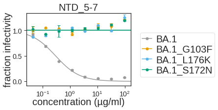
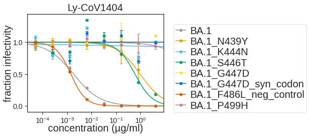
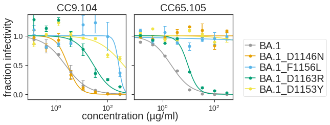
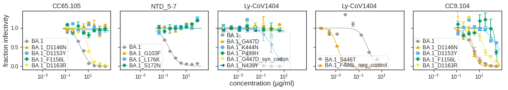

# Analysis of SARS-COV-2 spike mutant neutalization

### Set up Analysis


```python
import itertools
import math
import os
import re
import warnings

from IPython.display import display, HTML

import matplotlib
import matplotlib as mpl
import matplotlib.pyplot as plt
import natsort

import numpy as np
import pandas as pd
from plotnine import *
import seaborn

import neutcurve
from neutcurve.colorschemes import CBMARKERS, CBPALETTE

import yaml
```


```python
warnings.simplefilter('ignore')
```

Read config file.


```python
with open('config.yaml') as f:
    config = yaml.safe_load(f)
```

Set seaborn theme:


```python
theme_set(theme_seaborn(style='white', context='talk', font_scale=1))
plt.style.use('seaborn-white')
```


```python
resultsdir=config['resultsdir']
os.makedirs(resultsdir, exist_ok=True)
```

## Read in data


```python
frac_infect = pd.read_csv(config['mAb_neuts'], index_col=0)
```

## Fit Hill curve to data using [`neutcurve`](https://jbloomlab.github.io/neutcurve/)


```python
fits = neutcurve.CurveFits(frac_infect, fixbottom= 0, fixtop= True)
```


```python
fitparams = (
        fits.fitParams()
        # get columns of interest
        [['serum', 'ic50', 'ic50_bound','virus']]
        .assign(NT50=lambda x: 1/x['ic50'])        
        )
```


```python
fitparams['ic50_is_bound'] = fitparams['ic50_bound'].apply(lambda x: True if x!='interpolated' else False)
```


```python
fitparams
```


<div>
<style scoped>
    .dataframe tbody tr th:only-of-type {
        vertical-align: middle;
    }

    .dataframe tbody tr th {
        vertical-align: top;
    }

    .dataframe thead th {
        text-align: right;
    }
</style>
<table border="1" class="dataframe">
  <thead>
    <tr style="text-align: right;">
      <th></th>
      <th>serum</th>
      <th>ic50</th>
      <th>ic50_bound</th>
      <th>virus</th>
      <th>NT50</th>
      <th>ic50_is_bound</th>
    </tr>
  </thead>
  <tbody>
    <tr>
      <th>0</th>
      <td>CC65.105</td>
      <td>2.154867</td>
      <td>interpolated</td>
      <td>BA.1</td>
      <td>0.464066</td>
      <td>False</td>
    </tr>
    <tr>
      <th>1</th>
      <td>CC65.105</td>
      <td>300.000000</td>
      <td>lower</td>
      <td>BA.1_D1146N</td>
      <td>0.003333</td>
      <td>True</td>
    </tr>
    <tr>
      <th>2</th>
      <td>CC65.105</td>
      <td>300.000000</td>
      <td>lower</td>
      <td>BA.1_D1153Y</td>
      <td>0.003333</td>
      <td>True</td>
    </tr>
    <tr>
      <th>3</th>
      <td>CC65.105</td>
      <td>300.000000</td>
      <td>lower</td>
      <td>BA.1_F1156L</td>
      <td>0.003333</td>
      <td>True</td>
    </tr>
    <tr>
      <th>4</th>
      <td>CC65.105</td>
      <td>9.562059</td>
      <td>interpolated</td>
      <td>BA.1_D1163R</td>
      <td>0.104580</td>
      <td>False</td>
    </tr>
    <tr>
      <th>5</th>
      <td>NTD_5-7</td>
      <td>0.299517</td>
      <td>interpolated</td>
      <td>BA.1</td>
      <td>3.338705</td>
      <td>False</td>
    </tr>
    <tr>
      <th>6</th>
      <td>NTD_5-7</td>
      <td>96.000000</td>
      <td>lower</td>
      <td>BA.1_G103F</td>
      <td>0.010417</td>
      <td>True</td>
    </tr>
    <tr>
      <th>7</th>
      <td>NTD_5-7</td>
      <td>96.000000</td>
      <td>lower</td>
      <td>BA.1_L176K</td>
      <td>0.010417</td>
      <td>True</td>
    </tr>
    <tr>
      <th>8</th>
      <td>NTD_5-7</td>
      <td>96.000000</td>
      <td>lower</td>
      <td>BA.1_S172N</td>
      <td>0.010417</td>
      <td>True</td>
    </tr>
    <tr>
      <th>9</th>
      <td>Ly-CoV1404</td>
      <td>0.001839</td>
      <td>interpolated</td>
      <td>BA.1</td>
      <td>543.707452</td>
      <td>False</td>
    </tr>
    <tr>
      <th>10</th>
      <td>Ly-CoV1404</td>
      <td>4.000000</td>
      <td>lower</td>
      <td>BA.1_G447D</td>
      <td>0.250000</td>
      <td>True</td>
    </tr>
    <tr>
      <th>11</th>
      <td>Ly-CoV1404</td>
      <td>4.000000</td>
      <td>lower</td>
      <td>BA.1_K444N</td>
      <td>0.250000</td>
      <td>True</td>
    </tr>
    <tr>
      <th>12</th>
      <td>Ly-CoV1404</td>
      <td>4.000000</td>
      <td>lower</td>
      <td>BA.1_P499H</td>
      <td>0.250000</td>
      <td>True</td>
    </tr>
    <tr>
      <th>13</th>
      <td>Ly-CoV1404</td>
      <td>4.000000</td>
      <td>lower</td>
      <td>BA.1_G447D_syn_codon</td>
      <td>0.250000</td>
      <td>True</td>
    </tr>
    <tr>
      <th>14</th>
      <td>Ly-CoV1404</td>
      <td>0.962698</td>
      <td>interpolated</td>
      <td>BA.1_N439Y</td>
      <td>1.038747</td>
      <td>False</td>
    </tr>
    <tr>
      <th>15</th>
      <td>Ly-CoV1404</td>
      <td>0.595471</td>
      <td>interpolated</td>
      <td>BA.1_S446T</td>
      <td>1.679342</td>
      <td>False</td>
    </tr>
    <tr>
      <th>16</th>
      <td>Ly-CoV1404</td>
      <td>0.001433</td>
      <td>interpolated</td>
      <td>BA.1_F486L_neg_control</td>
      <td>697.593370</td>
      <td>False</td>
    </tr>
    <tr>
      <th>17</th>
      <td>CC9.104</td>
      <td>2.335419</td>
      <td>interpolated</td>
      <td>BA.1</td>
      <td>0.428189</td>
      <td>False</td>
    </tr>
    <tr>
      <th>18</th>
      <td>CC9.104</td>
      <td>2.897976</td>
      <td>interpolated</td>
      <td>BA.1_D1146N</td>
      <td>0.345068</td>
      <td>False</td>
    </tr>
    <tr>
      <th>19</th>
      <td>CC9.104</td>
      <td>300.000000</td>
      <td>lower</td>
      <td>BA.1_D1153Y</td>
      <td>0.003333</td>
      <td>True</td>
    </tr>
    <tr>
      <th>20</th>
      <td>CC9.104</td>
      <td>269.306973</td>
      <td>interpolated</td>
      <td>BA.1_F1156L</td>
      <td>0.003713</td>
      <td>False</td>
    </tr>
    <tr>
      <th>21</th>
      <td>CC9.104</td>
      <td>28.626005</td>
      <td>interpolated</td>
      <td>BA.1_D1163R</td>
      <td>0.034933</td>
      <td>False</td>
    </tr>
  </tbody>
</table>
</div>


## Plot neut curves for mAbs


```python
# mutations for NTD 5-7
fig, axes = fits.plotSera(sera = ['NTD_5-7'],
                          viruses=['BA.1','BA.1_G103F','BA.1_L176K',
                                   'BA.1_S172N'],
                          xlabel='concentration (µg/ml)',
                          ncol=3,
                          widthscale=1,
                          heightscale=1,
                          titlesize=20, labelsize=20, ticksize=14,
                          legendfontsize=20, yticklocs=[0,0.5,1],
                          markersize=5, linewidth=1.5,
                          max_viruses_per_subplot = 7,
                          markers=['o','o','o','o']
                         )
plotfile = 'NTD5-7.pdf'
print(f"Saving to {plotfile}")
fig.savefig(f'{resultsdir}/{plotfile}', bbox_inches='tight')
```

    Saving to NTD5-7.pdf


    

    


```python
# mutations for Ly-CoV1404
fig, axes = fits.plotSera(sera = ['Ly-CoV1404'],
                          viruses=['BA.1',
                                   'BA.1_N439Y',
                                   'BA.1_K444N',
                                   'BA.1_S446T',
                                   'BA.1_G447D','BA.1_G447D_syn_codon',
                                   'BA.1_F486L_neg_control',
                                   'BA.1_P499H'
                                   ],
                          xlabel='concentration (µg/ml)',
                          ncol=1,
                          widthscale=1.2,
                          heightscale=1.2,
                          titlesize=20, labelsize=20, ticksize=14,
                          legendfontsize=20, yticklocs=[0,0.5,1],
                          markersize=5, linewidth=1.5,
                          max_viruses_per_subplot = 8,
                          markers=['o','o','o','o','o','o','o','o']
                         )
plotfile = 'Ly-CoV1404_pilots_7.pdf'
print(f"Saving to {plotfile}")
fig.savefig(f'{resultsdir}/{plotfile}', bbox_inches='tight')
```

    Saving to Ly-CoV1404_pilots_7.pdf


    

    


```python
# mutations for CC9.104 and CC65.105

fig, axes = fits.plotSera(sera=['CC9.104', 'CC65.105'],
                          viruses=['BA.1','BA.1_D1146N',
                                   'BA.1_F1156L','BA.1_D1163R', 'BA.1_D1153Y'],
                          xlabel='concentration (µg/ml)',
                          ncol=2,
                          widthscale=1,
                          heightscale=1.2,
                          titlesize=20, labelsize=20, ticksize=14,
                          legendfontsize=20, yticklocs=[0,0.5,1],
                          markersize=5, linewidth=1.5,
                          max_viruses_per_subplot = 5,
                          markers=['o','o','o','o','o']
                         )
plotfile = 'CC9.104_CC67.105.pdf'
print(f"Saving to {plotfile}")
fig.savefig(f'{resultsdir}/{plotfile}', bbox_inches='tight')
```

    Saving to CC9.104_CC67.105.pdf


    

    


```python
fig, axes = fits.plotSera(
                max_viruses_per_subplot=6,
                nrow=1,
                ncol=None,
                xlabel='concentration (µg/ml)'
                )
```


    

    


```python

```
