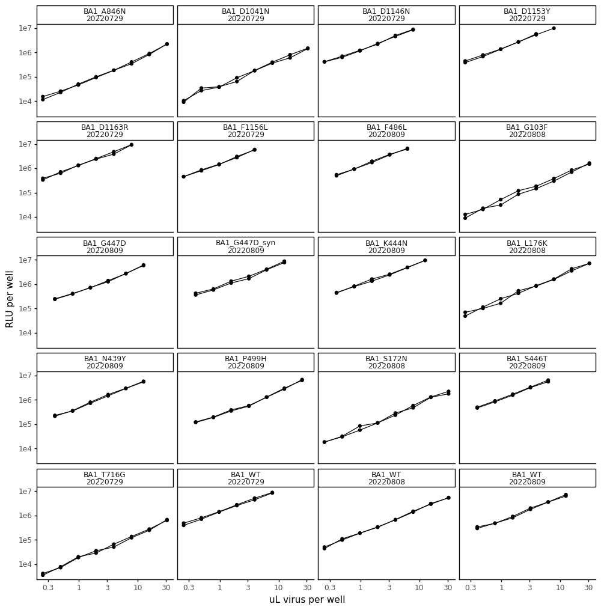
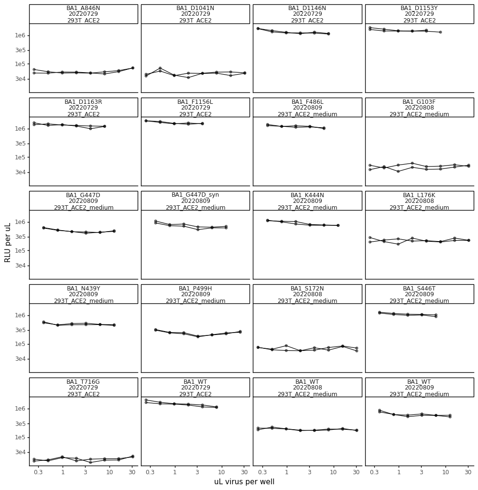
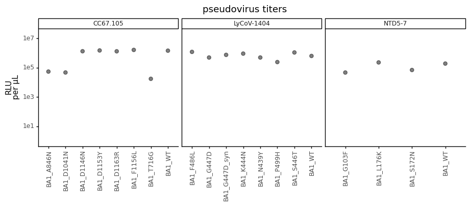

# Calculate titers of spike-pseudotyped lentiviruses used for antibody escape validations


```python
import os
import warnings

import math
import numpy as np 

from IPython.display import display, HTML
import matplotlib.pyplot as plt

from neutcurve.colorschemes import CBMARKERS, CBPALETTE
from mizani.formatters import scientific_format

import pandas as pd
from plotnine import *

import yaml
```


```python
warnings.simplefilter('ignore')
```

Read config


```python
with open('config.yaml') as f:
    config = yaml.safe_load(f)
```

Make output directory if needed


```python
resultsdir=config['resultsdir']
os.makedirs(resultsdir, exist_ok=True)
```


```python
titers = pd.read_csv(config['virus_titers_antibody'])

titers = (titers
          .assign(RLUperuL=lambda x: x['RLU_per_well'] / x['uL_virus'],
                  date=lambda x: x['date'].astype(str)
                 )
         )

display(HTML(titers.head().to_html(index=False)))
```


<table border="1" class="dataframe">
  <thead>
    <tr style="text-align: right;">
      <th>replicate</th>
      <th>virus</th>
      <th>dilution</th>
      <th>uL_virus</th>
      <th>RLU_per_well</th>
      <th>date</th>
      <th>cells</th>
      <th>amphoB</th>
      <th>antibody</th>
      <th>RLUperuL</th>
    </tr>
  </thead>
  <tbody>
    <tr>
      <td>rep1</td>
      <td>BA1_T716G</td>
      <td>0.312500</td>
      <td>31.250000</td>
      <td>637112</td>
      <td>20220729</td>
      <td>293T_ACE2</td>
      <td>with_amphoB</td>
      <td>CC67.105</td>
      <td>20387.584</td>
    </tr>
    <tr>
      <td>rep1</td>
      <td>BA1_T716G</td>
      <td>0.156250</td>
      <td>15.625000</td>
      <td>277617</td>
      <td>20220729</td>
      <td>293T_ACE2</td>
      <td>with_amphoB</td>
      <td>CC67.105</td>
      <td>17767.488</td>
    </tr>
    <tr>
      <td>rep1</td>
      <td>BA1_T716G</td>
      <td>0.078125</td>
      <td>7.812500</td>
      <td>137722</td>
      <td>20220729</td>
      <td>293T_ACE2</td>
      <td>with_amphoB</td>
      <td>CC67.105</td>
      <td>17628.416</td>
    </tr>
    <tr>
      <td>rep1</td>
      <td>BA1_T716G</td>
      <td>0.039062</td>
      <td>3.906250</td>
      <td>66559</td>
      <td>20220729</td>
      <td>293T_ACE2</td>
      <td>with_amphoB</td>
      <td>CC67.105</td>
      <td>17039.104</td>
    </tr>
    <tr>
      <td>rep1</td>
      <td>BA1_T716G</td>
      <td>0.019531</td>
      <td>1.953125</td>
      <td>28873</td>
      <td>20220729</td>
      <td>293T_ACE2</td>
      <td>with_amphoB</td>
      <td>CC67.105</td>
      <td>14782.976</td>
    </tr>
  </tbody>
</table>


```python
ncol=min(8, titers['virus'].nunique())
nrow=math.ceil(titers['virus'].nunique() / ncol)

p = (ggplot(titers.dropna()
            ) +
     aes('uL_virus', 'RLU_per_well', group='replicate') +
     geom_point(size=1.5) +
     geom_line() +
     facet_wrap('~virus+date', ncol=4) +
     scale_y_log10(name='RLU per well') +
     scale_x_log10(name='uL virus per well') +
     theme_classic() +
     theme(axis_text_x=element_text(),
           figure_size=(12,12),
           )
     )

_ = p.draw()
```


    

    


```python
p = (ggplot(titers.dropna()
            ) +
     aes('uL_virus', 'RLUperuL', group='replicate') +
     geom_point(size=1.5, alpha=0.5) +
     geom_line() +
     facet_wrap('~virus+date+cells', ncol=4) +
     scale_y_log10(name='RLU per uL') +
     scale_x_log10(name='uL virus per well') +
     theme_classic() +
     theme(axis_text_x=element_text(),
           figure_size=(12,12),
           ) 
     )

_ = p.draw()
```


    

    


Check that above plots are approximately linear 


```python
average_titers = (titers
                  .dropna() # missing values for some replicates
#                   .query('uL_virus > 1') # drop concentrations that would not be linear
                  .groupby(['virus', 'date', 'antibody'])
                  .agg(mean_RLUperuL=pd.NamedAgg(column='RLUperuL', aggfunc=np.mean))
                  .reset_index()
                 )

display(HTML(average_titers.head().to_html(index=False)))
```


<table border="1" class="dataframe">
  <thead>
    <tr style="text-align: right;">
      <th>virus</th>
      <th>date</th>
      <th>antibody</th>
      <th>mean_RLUperuL</th>
    </tr>
  </thead>
  <tbody>
    <tr>
      <td>BA1_A846N</td>
      <td>20220729</td>
      <td>CC67.105</td>
      <td>5.350405e+04</td>
    </tr>
    <tr>
      <td>BA1_D1041N</td>
      <td>20220729</td>
      <td>CC67.105</td>
      <td>4.644062e+04</td>
    </tr>
    <tr>
      <td>BA1_D1146N</td>
      <td>20220729</td>
      <td>CC67.105</td>
      <td>1.306077e+06</td>
    </tr>
    <tr>
      <td>BA1_D1153Y</td>
      <td>20220729</td>
      <td>CC67.105</td>
      <td>1.475216e+06</td>
    </tr>
    <tr>
      <td>BA1_D1163R</td>
      <td>20220729</td>
      <td>CC67.105</td>
      <td>1.292206e+06</td>
    </tr>
  </tbody>
</table>


```python
p = (ggplot(average_titers, 
            aes(x='virus', y='mean_RLUperuL')
           ) +
     geom_point(size=2.5, alpha=0.5)+
     theme_classic() +
     theme(axis_text_x=element_text(angle=90, vjust=1, hjust=0.5),
           figure_size=(average_titers['virus'].nunique()*.6,3),
           axis_title_x=element_blank()
          ) +
     facet_wrap('~antibody', ncol=4, scales = 'free_x') +
     scale_y_log10(limits=[1,2e7]) +
     ylab('RLU\nper µL')+
     labs(title='pseudovirus titers') +
     scale_color_manual(values=CBPALETTE)
    )

_ = p.draw()
```


    

    


Calculate how much virus to use in neut assays:


```python
target_RLU = 5e5
uL_virus_per_well = 50

dilute_virus = (average_titers
                .groupby(['virus', 'date', 'antibody'])
                .agg(RLUperuL=pd.NamedAgg(column='mean_RLUperuL', aggfunc=np.mean))
                .reset_index()
                .assign(target_RLU = target_RLU,
                        uL_virus_per_well = uL_virus_per_well,
                        dilution_factor = lambda x: x['RLUperuL']/target_RLU*uL_virus_per_well,
                        uL_per_8mL = lambda x: 8000/x['dilution_factor'],
                        media_for_8ml = lambda x: 8000 - 8000/x['dilution_factor']
                       )
               )


titerfile = os.path.join(resultsdir, 'virus_titers_antibody_validations.csv')
print(f"Saving to {titerfile}")

dilute_virus.to_csv(titerfile, index=False)

display(HTML(dilute_virus.to_html(index=False)))
```

    Saving to results/virus_titers_antibody_validations.csv


<table border="1" class="dataframe">
  <thead>
    <tr style="text-align: right;">
      <th>virus</th>
      <th>date</th>
      <th>antibody</th>
      <th>RLUperuL</th>
      <th>target_RLU</th>
      <th>uL_virus_per_well</th>
      <th>dilution_factor</th>
      <th>uL_per_8mL</th>
      <th>media_for_8ml</th>
    </tr>
  </thead>
  <tbody>
    <tr>
      <td>BA1_A846N</td>
      <td>20220729</td>
      <td>CC67.105</td>
      <td>5.350405e+04</td>
      <td>500000.0</td>
      <td>50</td>
      <td>5.350405</td>
      <td>1495.213970</td>
      <td>6504.786030</td>
    </tr>
    <tr>
      <td>BA1_D1041N</td>
      <td>20220729</td>
      <td>CC67.105</td>
      <td>4.644062e+04</td>
      <td>500000.0</td>
      <td>50</td>
      <td>4.644062</td>
      <td>1722.629887</td>
      <td>6277.370113</td>
    </tr>
    <tr>
      <td>BA1_D1146N</td>
      <td>20220729</td>
      <td>CC67.105</td>
      <td>1.306077e+06</td>
      <td>500000.0</td>
      <td>50</td>
      <td>130.607739</td>
      <td>61.252113</td>
      <td>7938.747887</td>
    </tr>
    <tr>
      <td>BA1_D1153Y</td>
      <td>20220729</td>
      <td>CC67.105</td>
      <td>1.475216e+06</td>
      <td>500000.0</td>
      <td>50</td>
      <td>147.521552</td>
      <td>54.229364</td>
      <td>7945.770636</td>
    </tr>
    <tr>
      <td>BA1_D1163R</td>
      <td>20220729</td>
      <td>CC67.105</td>
      <td>1.292206e+06</td>
      <td>500000.0</td>
      <td>50</td>
      <td>129.220589</td>
      <td>61.909639</td>
      <td>7938.090361</td>
    </tr>
    <tr>
      <td>BA1_F1156L</td>
      <td>20220729</td>
      <td>CC67.105</td>
      <td>1.605303e+06</td>
      <td>500000.0</td>
      <td>50</td>
      <td>160.530289</td>
      <td>49.834832</td>
      <td>7950.165168</td>
    </tr>
    <tr>
      <td>BA1_F486L</td>
      <td>20220809</td>
      <td>LyCoV-1404</td>
      <td>1.178870e+06</td>
      <td>500000.0</td>
      <td>50</td>
      <td>117.886974</td>
      <td>67.861611</td>
      <td>7932.138389</td>
    </tr>
    <tr>
      <td>BA1_G103F</td>
      <td>20220808</td>
      <td>NTD5-7</td>
      <td>4.609353e+04</td>
      <td>500000.0</td>
      <td>50</td>
      <td>4.609353</td>
      <td>1735.601504</td>
      <td>6264.398496</td>
    </tr>
    <tr>
      <td>BA1_G447D</td>
      <td>20220809</td>
      <td>LyCoV-1404</td>
      <td>4.867644e+05</td>
      <td>500000.0</td>
      <td>50</td>
      <td>48.676435</td>
      <td>164.350572</td>
      <td>7835.649428</td>
    </tr>
    <tr>
      <td>BA1_G447D_syn</td>
      <td>20220809</td>
      <td>LyCoV-1404</td>
      <td>7.386412e+05</td>
      <td>500000.0</td>
      <td>50</td>
      <td>73.864116</td>
      <td>108.306989</td>
      <td>7891.693011</td>
    </tr>
    <tr>
      <td>BA1_K444N</td>
      <td>20220809</td>
      <td>LyCoV-1404</td>
      <td>8.991716e+05</td>
      <td>500000.0</td>
      <td>50</td>
      <td>89.917163</td>
      <td>88.970778</td>
      <td>7911.029222</td>
    </tr>
    <tr>
      <td>BA1_L176K</td>
      <td>20220808</td>
      <td>NTD5-7</td>
      <td>2.254021e+05</td>
      <td>500000.0</td>
      <td>50</td>
      <td>22.540215</td>
      <td>354.921193</td>
      <td>7645.078807</td>
    </tr>
    <tr>
      <td>BA1_N439Y</td>
      <td>20220809</td>
      <td>LyCoV-1404</td>
      <td>4.877272e+05</td>
      <td>500000.0</td>
      <td>50</td>
      <td>48.772724</td>
      <td>164.026106</td>
      <td>7835.973894</td>
    </tr>
    <tr>
      <td>BA1_P499H</td>
      <td>20220809</td>
      <td>LyCoV-1404</td>
      <td>2.384163e+05</td>
      <td>500000.0</td>
      <td>50</td>
      <td>23.841632</td>
      <td>335.547495</td>
      <td>7664.452505</td>
    </tr>
    <tr>
      <td>BA1_S172N</td>
      <td>20220808</td>
      <td>NTD5-7</td>
      <td>6.852799e+04</td>
      <td>500000.0</td>
      <td>50</td>
      <td>6.852799</td>
      <td>1167.406194</td>
      <td>6832.593806</td>
    </tr>
    <tr>
      <td>BA1_S446T</td>
      <td>20220809</td>
      <td>LyCoV-1404</td>
      <td>1.075641e+06</td>
      <td>500000.0</td>
      <td>50</td>
      <td>107.564102</td>
      <td>74.374255</td>
      <td>7925.625745</td>
    </tr>
    <tr>
      <td>BA1_T716G</td>
      <td>20220729</td>
      <td>CC67.105</td>
      <td>1.717805e+04</td>
      <td>500000.0</td>
      <td>50</td>
      <td>1.717805</td>
      <td>4657.104932</td>
      <td>3342.895068</td>
    </tr>
    <tr>
      <td>BA1_WT</td>
      <td>20220729</td>
      <td>CC67.105</td>
      <td>1.426120e+06</td>
      <td>500000.0</td>
      <td>50</td>
      <td>142.612012</td>
      <td>56.096257</td>
      <td>7943.903743</td>
    </tr>
    <tr>
      <td>BA1_WT</td>
      <td>20220808</td>
      <td>NTD5-7</td>
      <td>1.877758e+05</td>
      <td>500000.0</td>
      <td>50</td>
      <td>18.777582</td>
      <td>426.039954</td>
      <td>7573.960046</td>
    </tr>
    <tr>
      <td>BA1_WT</td>
      <td>20220809</td>
      <td>LyCoV-1404</td>
      <td>6.217454e+05</td>
      <td>500000.0</td>
      <td>50</td>
      <td>62.174537</td>
      <td>128.670037</td>
      <td>7871.329963</td>
    </tr>
  </tbody>
</table>


```python

```
