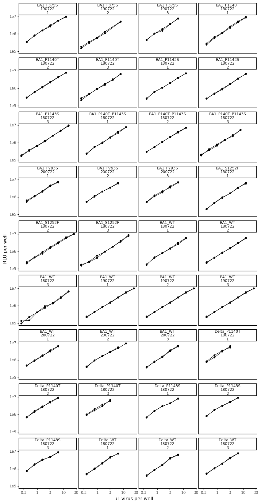
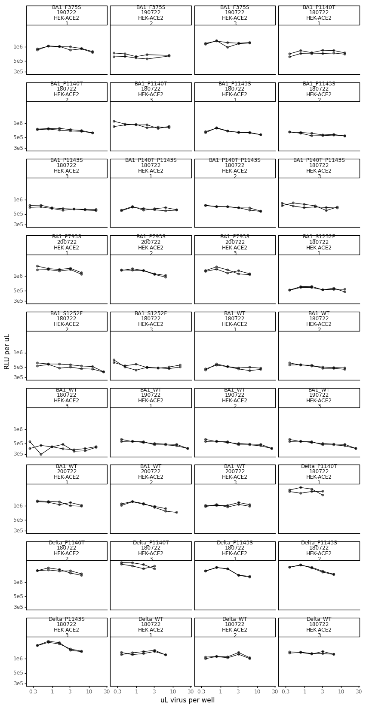
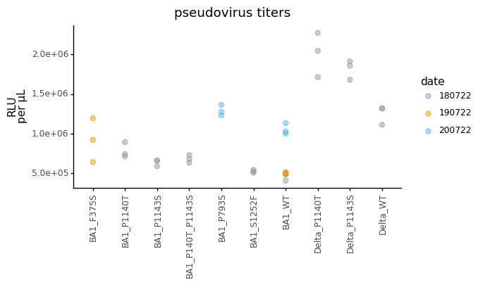
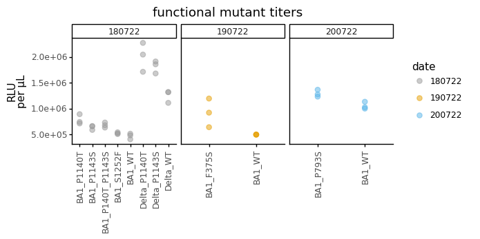
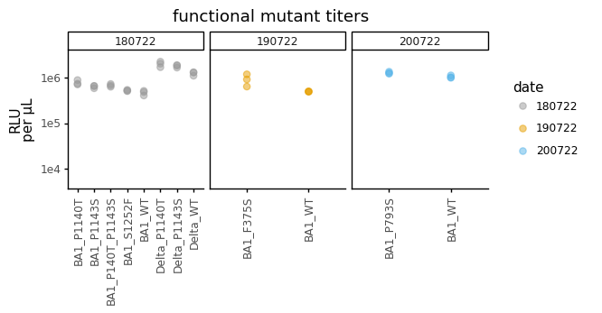

# Calculate titers of spike-pseudotyped lentiviruses used for functional mutant validations


```python
import os
import warnings

import math
import numpy as np 

from IPython.display import display, HTML
import matplotlib.pyplot as plt

from neutcurve.colorschemes import CBMARKERS, CBPALETTE
from mizani.formatters import scientific_format

import pandas as pd
from plotnine import *

import yaml
```


```python
warnings.simplefilter('ignore')
```

Read config


```python
with open('config.yaml') as f:
    config = yaml.safe_load(f)
```

Make output directory if needed


```python
resultsdir=config['resultsdir']
os.makedirs(resultsdir, exist_ok=True)
```


```python
titers = pd.read_csv(config['virus_titers_functional'])

titers = (titers
          .assign(RLUperuL=lambda x: x['RLU_per_well'] / x['uL_virus'],
                  date=lambda x: x['date'].astype(str)
                 )
         )

display(HTML(titers.head().to_html(index=False)))
```


<table border="1" class="dataframe">
  <thead>
    <tr style="text-align: right;">
      <th>replicate</th>
      <th>virus</th>
      <th>dilution</th>
      <th>uL_virus</th>
      <th>RLU_per_well</th>
      <th>date</th>
      <th>cells</th>
      <th>for_testing</th>
      <th>rescue_batch</th>
      <th>RLUperuL</th>
    </tr>
  </thead>
  <tbody>
    <tr>
      <td>rep1</td>
      <td>BA1_P1140T</td>
      <td>0.125000</td>
      <td>12.50000</td>
      <td>9310111.0</td>
      <td>180722</td>
      <td>HEK-ACE2</td>
      <td>functional_validation</td>
      <td>1</td>
      <td>744808.88</td>
    </tr>
    <tr>
      <td>rep1</td>
      <td>BA1_P1140T</td>
      <td>0.062500</td>
      <td>6.25000</td>
      <td>5212579.0</td>
      <td>180722</td>
      <td>HEK-ACE2</td>
      <td>functional_validation</td>
      <td>1</td>
      <td>834012.64</td>
    </tr>
    <tr>
      <td>rep1</td>
      <td>BA1_P1140T</td>
      <td>0.031250</td>
      <td>3.12500</td>
      <td>2640190.0</td>
      <td>180722</td>
      <td>HEK-ACE2</td>
      <td>functional_validation</td>
      <td>1</td>
      <td>844860.80</td>
    </tr>
    <tr>
      <td>rep1</td>
      <td>BA1_P1140T</td>
      <td>0.015625</td>
      <td>1.56250</td>
      <td>1173109.0</td>
      <td>180722</td>
      <td>HEK-ACE2</td>
      <td>functional_validation</td>
      <td>1</td>
      <td>750789.76</td>
    </tr>
    <tr>
      <td>rep1</td>
      <td>BA1_P1140T</td>
      <td>0.007812</td>
      <td>0.78125</td>
      <td>649025.0</td>
      <td>180722</td>
      <td>HEK-ACE2</td>
      <td>functional_validation</td>
      <td>1</td>
      <td>830752.00</td>
    </tr>
  </tbody>
</table>


```python
ncol=min(8, titers['virus'].nunique())
nrow=math.ceil(titers['virus'].nunique() / ncol)

p = (ggplot(titers.dropna()
            ) +
     aes('uL_virus', 'RLU_per_well', group='replicate') +
     geom_point(size=1.5) +
     geom_line() +
     facet_wrap('~virus+date+rescue_batch', ncol=4) +
     scale_y_log10(name='RLU per well') +
     scale_x_log10(name='uL virus per well') +
     theme_classic() +
     theme(axis_text_x=element_text(),
           figure_size=(10,20),
           )
     )

_ = p.draw()
```


    

    


```python
p = (ggplot(titers.dropna()
            ) +
     aes('uL_virus', 'RLUperuL', group='replicate') +
     geom_point(size=1.5, alpha=0.5) +
     geom_line() +
     facet_wrap('~virus+date+cells+rescue_batch', ncol=4) +
     scale_y_log10(name='RLU per uL') +
     scale_x_log10(name='uL virus per well') +
     theme_classic() +
     theme(axis_text_x=element_text(),
           figure_size=(10,20),
           ) 
     )

_ = p.draw()
```


    

    


Check that above plots are approximately linear 


```python
average_titers = (titers
                  .dropna() # missing values for some replicates
#                   .query('uL_virus > 1') # drop concentrations that would not be linear
                  .groupby(['virus', 'date', 'rescue_batch', 'for_testing'])
                  .agg(mean_RLUperuL=pd.NamedAgg(column='RLUperuL', aggfunc=np.mean))
                  .reset_index()
                 )

display(HTML(average_titers.head().to_html(index=False)))
```


<table border="1" class="dataframe">
  <thead>
    <tr style="text-align: right;">
      <th>virus</th>
      <th>date</th>
      <th>rescue_batch</th>
      <th>for_testing</th>
      <th>mean_RLUperuL</th>
    </tr>
  </thead>
  <tbody>
    <tr>
      <td>BA1_F375S</td>
      <td>190722</td>
      <td>1</td>
      <td>functional_validation</td>
      <td>9.230974e+05</td>
    </tr>
    <tr>
      <td>BA1_F375S</td>
      <td>190722</td>
      <td>2</td>
      <td>functional_validation</td>
      <td>6.427330e+05</td>
    </tr>
    <tr>
      <td>BA1_F375S</td>
      <td>190722</td>
      <td>3</td>
      <td>functional_validation</td>
      <td>1.195813e+06</td>
    </tr>
    <tr>
      <td>BA1_P1140T</td>
      <td>180722</td>
      <td>1</td>
      <td>functional_validation</td>
      <td>7.436016e+05</td>
    </tr>
    <tr>
      <td>BA1_P1140T</td>
      <td>180722</td>
      <td>2</td>
      <td>functional_validation</td>
      <td>7.144444e+05</td>
    </tr>
  </tbody>
</table>


```python
p = (ggplot(average_titers, 
            aes(x='virus', y='mean_RLUperuL', color='date')
           ) +
     geom_point(size=2.5, alpha=0.5)+
     theme_classic() +
     theme(axis_text_x=element_text(angle=90, vjust=1, hjust=0.5),
           figure_size=(average_titers['virus'].nunique()*.6,3),
           axis_title_x=element_blank()
          ) +
     scale_y_continuous(labels=scientific_format(digits=2))+
     ylab('RLU\nper µL')+
     labs(title='pseudovirus titers') +
     scale_color_manual(values=CBPALETTE)
    )

_ = p.draw()
```


    

    


Calculate how much virus to use in neut assays:


```python
p = (ggplot(average_titers, 
            aes(x='virus', y='mean_RLUperuL', color='date')
           ) +
     geom_point(size=2.5, alpha=0.5)+
     theme_classic() +
     theme(axis_text_x=element_text(angle=90, vjust=1, hjust=0.5),
           figure_size=(average_titers['virus'].nunique()*0.6,2),
           axis_title_x=element_blank(),
          ) +
     facet_wrap('~date', scales='free_x') +
     ylab('RLU\nper µL')+
     scale_y_continuous(labels=scientific_format(digits=2))+
     labs(title='functional mutant titers') +
     scale_color_manual(values=CBPALETTE)
    )

_ = p.draw()
```


    

    


```python
h = (ggplot(average_titers, 
            aes(x='virus', y='mean_RLUperuL', color='date')
           ) +
     geom_point(size=2.5, alpha=0.5)+
     theme_classic() +
     theme(axis_text_x=element_text(angle=90, vjust=1, hjust=0.5),
           figure_size=(average_titers['virus'].nunique()*0.6,2),
           axis_title_x=element_blank(),
          ) +
     facet_wrap('~date', scales='free_x') +
     ylab('RLU\nper µL')+
     labs(title='functional mutant titers') +
     scale_color_manual(values=CBPALETTE)+
     scale_y_log10(limits=[5e3,3e6])
    )

_ = h.draw()
```


    

    


```python
target_RLU = 2e5
uL_virus_per_well = 50

dilute_virus = (average_titers
                .groupby(['virus', 'date', 'rescue_batch', 'for_testing'])
                .agg(RLUperuL=pd.NamedAgg(column='mean_RLUperuL', aggfunc=np.mean))
                .reset_index()
                .assign(target_RLU = target_RLU,
                        uL_virus_per_well = uL_virus_per_well,
                        dilution_factor = lambda x: x['RLUperuL']/target_RLU*uL_virus_per_well,
                        uL_per_8mL = lambda x: 8000/x['dilution_factor'],
                        media_for_8ml = lambda x: 8000 - 8000/x['dilution_factor']
                       )
               )


titerfile = os.path.join(resultsdir, 'virus_titers_functional_validations.csv')
print(f"Saving to {titerfile}")

dilute_virus.to_csv(titerfile, index=False)

display(HTML(dilute_virus.to_html(index=False)))
```

    Saving to results/virus_titers_functional_validations.csv


<table border="1" class="dataframe">
  <thead>
    <tr style="text-align: right;">
      <th>virus</th>
      <th>date</th>
      <th>rescue_batch</th>
      <th>for_testing</th>
      <th>RLUperuL</th>
      <th>target_RLU</th>
      <th>uL_virus_per_well</th>
      <th>dilution_factor</th>
      <th>uL_per_8mL</th>
      <th>media_for_8ml</th>
    </tr>
  </thead>
  <tbody>
    <tr>
      <td>BA1_F375S</td>
      <td>190722</td>
      <td>1</td>
      <td>functional_validation</td>
      <td>9.230974e+05</td>
      <td>200000.0</td>
      <td>50</td>
      <td>230.774348</td>
      <td>34.665898</td>
      <td>7965.334102</td>
    </tr>
    <tr>
      <td>BA1_F375S</td>
      <td>190722</td>
      <td>2</td>
      <td>functional_validation</td>
      <td>6.427330e+05</td>
      <td>200000.0</td>
      <td>50</td>
      <td>160.683245</td>
      <td>49.787394</td>
      <td>7950.212606</td>
    </tr>
    <tr>
      <td>BA1_F375S</td>
      <td>190722</td>
      <td>3</td>
      <td>functional_validation</td>
      <td>1.195813e+06</td>
      <td>200000.0</td>
      <td>50</td>
      <td>298.953204</td>
      <td>26.760041</td>
      <td>7973.239959</td>
    </tr>
    <tr>
      <td>BA1_P1140T</td>
      <td>180722</td>
      <td>1</td>
      <td>functional_validation</td>
      <td>7.436016e+05</td>
      <td>200000.0</td>
      <td>50</td>
      <td>185.900402</td>
      <td>43.033796</td>
      <td>7956.966204</td>
    </tr>
    <tr>
      <td>BA1_P1140T</td>
      <td>180722</td>
      <td>2</td>
      <td>functional_validation</td>
      <td>7.144444e+05</td>
      <td>200000.0</td>
      <td>50</td>
      <td>178.611100</td>
      <td>44.790049</td>
      <td>7955.209951</td>
    </tr>
    <tr>
      <td>BA1_P1140T</td>
      <td>180722</td>
      <td>3</td>
      <td>functional_validation</td>
      <td>8.939412e+05</td>
      <td>200000.0</td>
      <td>50</td>
      <td>223.485312</td>
      <td>35.796536</td>
      <td>7964.203464</td>
    </tr>
    <tr>
      <td>BA1_P1143S</td>
      <td>180722</td>
      <td>1</td>
      <td>functional_validation</td>
      <td>6.646749e+05</td>
      <td>200000.0</td>
      <td>50</td>
      <td>166.168717</td>
      <td>48.143839</td>
      <td>7951.856161</td>
    </tr>
    <tr>
      <td>BA1_P1143S</td>
      <td>180722</td>
      <td>2</td>
      <td>functional_validation</td>
      <td>5.898170e+05</td>
      <td>200000.0</td>
      <td>50</td>
      <td>147.454247</td>
      <td>54.254117</td>
      <td>7945.745883</td>
    </tr>
    <tr>
      <td>BA1_P1143S</td>
      <td>180722</td>
      <td>3</td>
      <td>functional_validation</td>
      <td>6.604765e+05</td>
      <td>200000.0</td>
      <td>50</td>
      <td>165.119114</td>
      <td>48.449872</td>
      <td>7951.550128</td>
    </tr>
    <tr>
      <td>BA1_P140T_P1143S</td>
      <td>180722</td>
      <td>1</td>
      <td>functional_validation</td>
      <td>6.352270e+05</td>
      <td>200000.0</td>
      <td>50</td>
      <td>158.806752</td>
      <td>50.375692</td>
      <td>7949.624308</td>
    </tr>
    <tr>
      <td>BA1_P140T_P1143S</td>
      <td>180722</td>
      <td>2</td>
      <td>functional_validation</td>
      <td>6.802035e+05</td>
      <td>200000.0</td>
      <td>50</td>
      <td>170.050878</td>
      <td>47.044744</td>
      <td>7952.955256</td>
    </tr>
    <tr>
      <td>BA1_P140T_P1143S</td>
      <td>180722</td>
      <td>3</td>
      <td>functional_validation</td>
      <td>7.326845e+05</td>
      <td>200000.0</td>
      <td>50</td>
      <td>183.171117</td>
      <td>43.675008</td>
      <td>7956.324992</td>
    </tr>
    <tr>
      <td>BA1_P793S</td>
      <td>200722</td>
      <td>1</td>
      <td>functional_validation</td>
      <td>1.365625e+06</td>
      <td>200000.0</td>
      <td>50</td>
      <td>341.406344</td>
      <td>23.432488</td>
      <td>7976.567512</td>
    </tr>
    <tr>
      <td>BA1_P793S</td>
      <td>200722</td>
      <td>2</td>
      <td>functional_validation</td>
      <td>1.232795e+06</td>
      <td>200000.0</td>
      <td>50</td>
      <td>308.198648</td>
      <td>25.957285</td>
      <td>7974.042715</td>
    </tr>
    <tr>
      <td>BA1_P793S</td>
      <td>200722</td>
      <td>3</td>
      <td>functional_validation</td>
      <td>1.275231e+06</td>
      <td>200000.0</td>
      <td>50</td>
      <td>318.807852</td>
      <td>25.093485</td>
      <td>7974.906515</td>
    </tr>
    <tr>
      <td>BA1_S1252F</td>
      <td>180722</td>
      <td>1</td>
      <td>functional_validation</td>
      <td>5.444239e+05</td>
      <td>200000.0</td>
      <td>50</td>
      <td>136.105968</td>
      <td>58.777731</td>
      <td>7941.222269</td>
    </tr>
    <tr>
      <td>BA1_S1252F</td>
      <td>180722</td>
      <td>2</td>
      <td>functional_validation</td>
      <td>5.102484e+05</td>
      <td>200000.0</td>
      <td>50</td>
      <td>127.562095</td>
      <td>62.714555</td>
      <td>7937.285445</td>
    </tr>
    <tr>
      <td>BA1_S1252F</td>
      <td>180722</td>
      <td>3</td>
      <td>functional_validation</td>
      <td>5.232961e+05</td>
      <td>200000.0</td>
      <td>50</td>
      <td>130.824037</td>
      <td>61.150842</td>
      <td>7938.849158</td>
    </tr>
    <tr>
      <td>BA1_WT</td>
      <td>180722</td>
      <td>1</td>
      <td>functional_validation</td>
      <td>4.848001e+05</td>
      <td>200000.0</td>
      <td>50</td>
      <td>121.200030</td>
      <td>66.006584</td>
      <td>7933.993416</td>
    </tr>
    <tr>
      <td>BA1_WT</td>
      <td>180722</td>
      <td>2</td>
      <td>functional_validation</td>
      <td>5.172177e+05</td>
      <td>200000.0</td>
      <td>50</td>
      <td>129.304423</td>
      <td>61.869500</td>
      <td>7938.130500</td>
    </tr>
    <tr>
      <td>BA1_WT</td>
      <td>180722</td>
      <td>3</td>
      <td>functional_validation</td>
      <td>4.087164e+05</td>
      <td>200000.0</td>
      <td>50</td>
      <td>102.179095</td>
      <td>78.293902</td>
      <td>7921.706098</td>
    </tr>
    <tr>
      <td>BA1_WT</td>
      <td>190722</td>
      <td>1</td>
      <td>functional_validation</td>
      <td>4.996201e+05</td>
      <td>200000.0</td>
      <td>50</td>
      <td>124.905031</td>
      <td>64.048661</td>
      <td>7935.951339</td>
    </tr>
    <tr>
      <td>BA1_WT</td>
      <td>190722</td>
      <td>2</td>
      <td>functional_validation</td>
      <td>4.996201e+05</td>
      <td>200000.0</td>
      <td>50</td>
      <td>124.905031</td>
      <td>64.048661</td>
      <td>7935.951339</td>
    </tr>
    <tr>
      <td>BA1_WT</td>
      <td>190722</td>
      <td>3</td>
      <td>functional_validation</td>
      <td>4.996201e+05</td>
      <td>200000.0</td>
      <td>50</td>
      <td>124.905031</td>
      <td>64.048661</td>
      <td>7935.951339</td>
    </tr>
    <tr>
      <td>BA1_WT</td>
      <td>200722</td>
      <td>1</td>
      <td>functional_validation</td>
      <td>1.133708e+06</td>
      <td>200000.0</td>
      <td>50</td>
      <td>283.426916</td>
      <td>28.225971</td>
      <td>7971.774029</td>
    </tr>
    <tr>
      <td>BA1_WT</td>
      <td>200722</td>
      <td>2</td>
      <td>functional_validation</td>
      <td>1.001413e+06</td>
      <td>200000.0</td>
      <td>50</td>
      <td>250.353369</td>
      <td>31.954833</td>
      <td>7968.045167</td>
    </tr>
    <tr>
      <td>BA1_WT</td>
      <td>200722</td>
      <td>3</td>
      <td>functional_validation</td>
      <td>1.027659e+06</td>
      <td>200000.0</td>
      <td>50</td>
      <td>256.914832</td>
      <td>31.138724</td>
      <td>7968.861276</td>
    </tr>
    <tr>
      <td>Delta_P1140T</td>
      <td>180722</td>
      <td>1</td>
      <td>functional_validation</td>
      <td>2.044512e+06</td>
      <td>200000.0</td>
      <td>50</td>
      <td>511.128020</td>
      <td>15.651656</td>
      <td>7984.348344</td>
    </tr>
    <tr>
      <td>Delta_P1140T</td>
      <td>180722</td>
      <td>2</td>
      <td>functional_validation</td>
      <td>1.712281e+06</td>
      <td>200000.0</td>
      <td>50</td>
      <td>428.070240</td>
      <td>18.688522</td>
      <td>7981.311478</td>
    </tr>
    <tr>
      <td>Delta_P1140T</td>
      <td>180722</td>
      <td>3</td>
      <td>functional_validation</td>
      <td>2.270375e+06</td>
      <td>200000.0</td>
      <td>50</td>
      <td>567.593780</td>
      <td>14.094587</td>
      <td>7985.905413</td>
    </tr>
    <tr>
      <td>Delta_P1143S</td>
      <td>180722</td>
      <td>1</td>
      <td>functional_validation</td>
      <td>1.679984e+06</td>
      <td>200000.0</td>
      <td>50</td>
      <td>419.996104</td>
      <td>19.047796</td>
      <td>7980.952204</td>
    </tr>
    <tr>
      <td>Delta_P1143S</td>
      <td>180722</td>
      <td>2</td>
      <td>functional_validation</td>
      <td>1.911510e+06</td>
      <td>200000.0</td>
      <td>50</td>
      <td>477.877564</td>
      <td>16.740690</td>
      <td>7983.259310</td>
    </tr>
    <tr>
      <td>Delta_P1143S</td>
      <td>180722</td>
      <td>3</td>
      <td>functional_validation</td>
      <td>1.856691e+06</td>
      <td>200000.0</td>
      <td>50</td>
      <td>464.172760</td>
      <td>17.234962</td>
      <td>7982.765038</td>
    </tr>
    <tr>
      <td>Delta_WT</td>
      <td>180722</td>
      <td>1</td>
      <td>functional_validation</td>
      <td>1.319633e+06</td>
      <td>200000.0</td>
      <td>50</td>
      <td>329.908364</td>
      <td>24.249158</td>
      <td>7975.750842</td>
    </tr>
    <tr>
      <td>Delta_WT</td>
      <td>180722</td>
      <td>2</td>
      <td>functional_validation</td>
      <td>1.112373e+06</td>
      <td>200000.0</td>
      <td>50</td>
      <td>278.093160</td>
      <td>28.767338</td>
      <td>7971.232662</td>
    </tr>
    <tr>
      <td>Delta_WT</td>
      <td>180722</td>
      <td>3</td>
      <td>functional_validation</td>
      <td>1.319245e+06</td>
      <td>200000.0</td>
      <td>50</td>
      <td>329.811172</td>
      <td>24.256304</td>
      <td>7975.743696</td>
    </tr>
  </tbody>
</table>


```python

```
